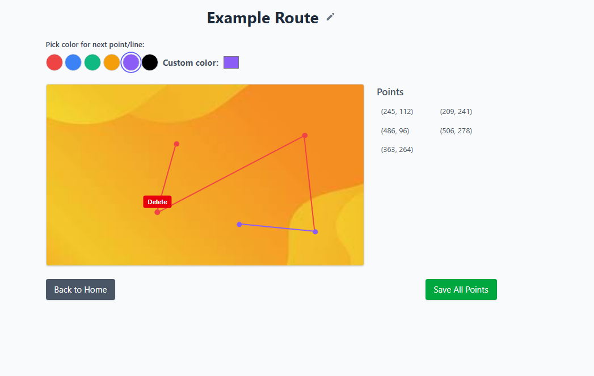
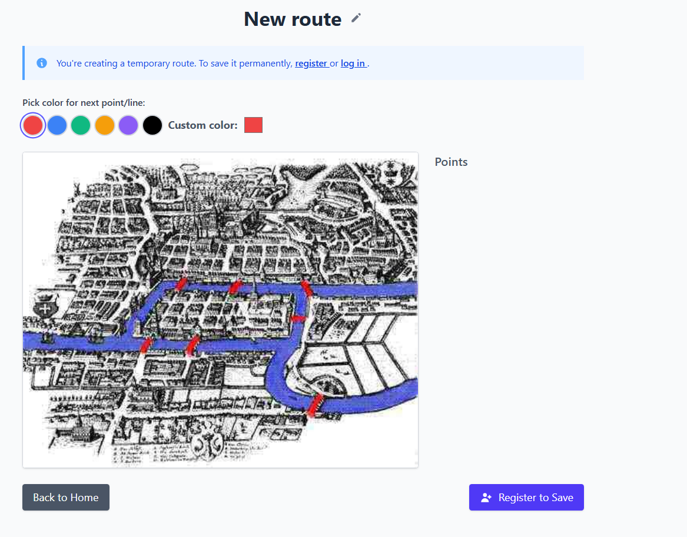
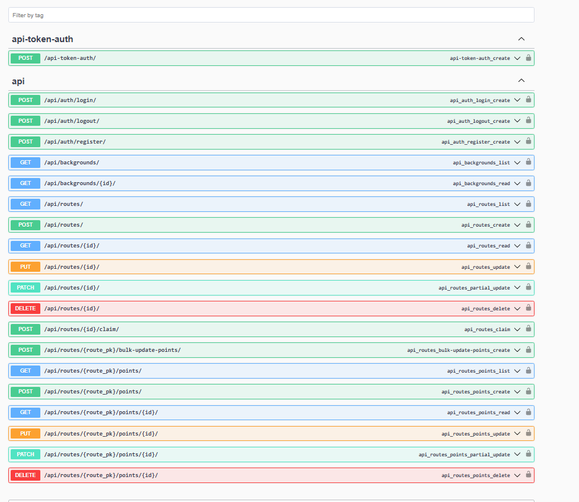

# 🗺️ TraceApp

A web application that allows users to draw routes on images.

---

## 🧭 Overview

**TraceApp** is a Django and Tailwind CSS-powered web application that enables users to trace and draw routes on uploaded images.  
It offers an intuitive interface where users can create, edit, and save their routes — even without an account.

---

## ✨ Features

- 🖍️ **Interactive Drawing** – Draw custom routes on any uploaded image
- 🕵️ **Anonymous Creation** – Start tracing immediately without logging in
- 🔐 **User Authentication** – Save and manage your work after signing in
- 🎨 **Modern Design** – Clean, responsive UI built with Tailwind CSS

---

## 🛠️ Technologies

- 🐍 **Backend**: Django
- 🎨 **Frontend**: Tailwind CSS
- 💾 **Database**: SQLite (default)
- ⚙️ **JavaScript**: Custom drawing logic

---

## 🚀 Installation

1. 📥 Clone the repository

```bash
git clone https://github.com/MMax337/traceapp.git
cd traceapp
```

2. 🧪 Set up a virtual environment

```bash
python -m venv env
source env/bin/activate  # On Windows use: env\Scripts\activate.psl
```

3. 📦 Install backend dependencies

```bash
pip install -r requirements.txt
```

4. 🔄 Apply database migrations

```bash
python manage.py migrate
```

5. ▶️ Start the development server

```bash
python manage.py runserver
```

Then open your browser and go to:  
[http://localhost:8000](http://localhost:8000)

---

## 📸 Screenshots

### 🖌️ Drawing Interface



### ✏️ Route Editor


### 🧪 API



